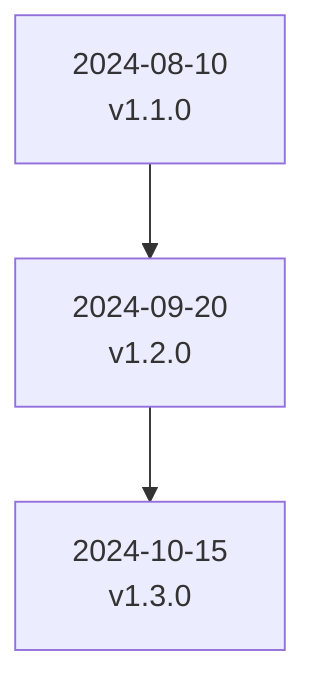

## Recent Updates

<Callout kind="info" title="Stay Informed">
Subscribe to our newsletter or follow us on social media to get notified about new releases. Check the [app dashboard](https://app.lickity.click) for in-app notifications.
</Callout>

View the most impactful recent changes across Lickity Click. Updates focus on enhancing link analytics, reporting, integrations, and performance.

<Columns cols={3}>
  <Card title="v1.3.0" icon="zap" href="#v1-3-0">
    Real-time analytics upgrades and new reporting tools.
  </Card>
  <Card title="v1.2.0" icon="trending-up" href="#v1-2-0">
    Custom domain improvements and QR code enhancements.
  </Card>
  <Card title="v1.1.0" icon="shield" href="#v1-1-0">
    Link health monitoring and smart redirect fixes.
  </Card>
</Columns>

## Release Timeline

## v1.3.0 (2024-10-15)

<id>v1-3-0</id>

<Update label="2024-10-15" description="v1.3.0" tags={["feature", "improvement"]}>

## New Features

- Added advanced reporting with CSV export and scheduled emails for campaigns.
- New integration with Google Analytics 4 for seamless tracking.

## Improvements

- Dashboard load times reduced by 40% for large link groups.
- Enhanced country and device analytics with heatmaps.

## Bug Fixes

- Fixed referrer tracking issues in private browsing modes.
- Resolved bulk slug generation errors on high-volume pastes.

</Update>

## v1.2.0 (2024-09-20)

<id>v1-2-0</id>

<Update label="2024-09-20" description="v1.2.0" tags={["feature", "bugfix"]}>

## New Features

- Custom domain setup now supports wildcard subdomains.
- Instant QR code generation with customizable branding colors.

## Improvements

- UTM builder now auto-suggests parameters based on popular campaigns.
- Smart redirects support geolocation-based routing.

## Bug Fixes

- Corrected A/B testing traffic split inconsistencies.
- Fixed mobile app preview rendering for links.

</Update>

## v1.1.0 (2024-08-10)

<id>v1-1-0</id>

<Update label="2024-08-10" description="v1.1.0" tags={["feature", "improvement", "bugfix"]}>

## New Features

- Link health monitoring with real-time alerts for broken destinations.
- Campaign grouping for sponsor deals and easy PDF reports.

## Improvements

- Real-time click stats now update in under 500ms.
- Added device-specific QR code variants.

## Bug Fixes

- Patched destination URL validation edge cases.
- Improved error handling for invalid custom slugs.

</Update>

## How to Enable Update Notifications

Follow these steps to stay ahead of new features.

<Steps>
  <Step title="Access Settings" icon="settings">
    Navigate to your account settings in the dashboard.
  </Step>
  <Step title="Enable Notifications" icon="bell">
    Toggle on email and in-app update alerts.
  </Step>
  <Step title="Review Changelog" icon="book-open">
    Bookmark this page or use the app's built-in changelog viewer.
  </Step>
</Steps>

## Older Releases

<Expandable title="View v1.0.x and earlier" default-open="false">

| Version | Date       | Key Changes                  |
|---------|------------|------------------------------|
| v1.0.5 | 2024-07-15 | Initial bulk shorten support |
| v1.0.0 | 2024-06-01 | Core link shortening launch  |

For full details, contact support.

</Expandable>

<Callout kind="tip">
Upgrade automatically happens on your next login. No action required for cloud-hosted features.
</Callout>