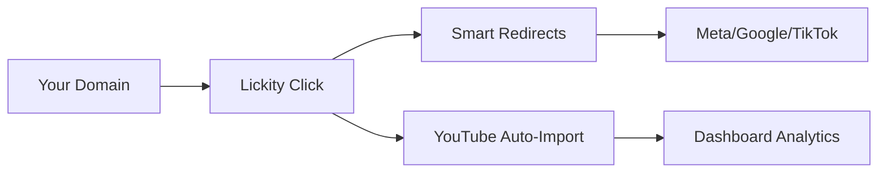

## Overview

Lickity Click integrates seamlessly with popular services to supercharge your link tracking. Set up custom domains, configure smart redirects, connect to YouTube, and enable conversion tracking for platforms like Meta, Google, and TikTok. These features help you automate workflows and gain deeper insights into your audience.

<Callout kind="tip">
Review your plan limits before enabling advanced integrations. Creator+ and Pro plans unlock unlimited custom domains and server-side events.
</Callout>

## Custom Domains via DNS

Point your own domain to Lickity Click using a simple DNS record. This takes about 60 seconds and gives you fully branded short links like `yourdomain.com/go`.

<Steps>
  <Step title="Log in to DNS Provider" icon="settings">
    Access your domain registrar or DNS provider dashboard (e.g., Cloudflare, Namecheap).
  </Step>
  <Step title="Add CNAME Record" icon="database">
    Create a CNAME record:
    
````bash
Name: go (or your subdomain)
Target: links.lickity.click
TTL: Auto
````
  </Step>
  <Step title="Verify in Dashboard" icon="check-circle">
    Go to your Lickity Click dashboard > Domains > Add Domain. Enter `go.yourdomain.com` and verify.
  </Step>
</Steps>

<Columns cols={2}>
  <Card title="Supported Providers" icon="globe" href="#">
    Cloudflare, GoDaddy, Namecheap, Route 53.
  </Card>
  <Card title="Propagation Time" icon="clock" href="#">
    Usually instant, up to 5 minutes max.
  </Card>
</Columns>

## Smart Redirects

Route traffic intelligently without code. Use rules for A/B testing, device targeting, or geo-routing.

### A/B Testing Setup

```javascript
// Example rule configuration via API
const rules = {
  path: "/test",
  rules: [
    { weight: 50, destination: "https://site-a.com" },
    { weight: 50, destination: "https://site-b.com" }
  ]
};
```

<Tabs>
  <Tab title="Device Routing" icon="smartphone">
    Redirect mobile users to app stores and desktop to web.
    
````javascript
{
  "conditions": [
    { "type": "device", "value": "mobile", "destination": "https://appstore.com" },
    { "type": "device", "value": "desktop", "destination": "https://web.com" }
  ]
}
````
  </Tab>
  <Tab title="Geo Routing" icon="map">
    Send US traffic to one page, EU to another.
    
````javascript
{
  "conditions": [
    { "country": "US", "destination": "https://us-site.com" },
    { "country": "EU", "destination": "https://eu-site.com" }
  ]
}
````
  </Tab>
</Tabs>

## YouTube Integration

Auto-import video links from your channel for instant shortening and tracking.

<Steps>
  <Step title="Connect YouTube" icon="play-circle">
    In dashboard > Integrations > YouTube > Connect Account.
  </Step>
  <Step title="Select Channel" icon="users">
    Choose your channel and grant read access.
  </Step>
  <Step title="Auto-Shorten New Videos" icon="zap">
    Enable auto-import. New uploads get shortened links like `yourdomain.com/watch?v=ID`.
  </Step>
</Steps>

<Expandable title="Advanced: Webhook for Custom Videos" default-open="false">
Set up webhooks to trigger on new videos.

````javascript
// POST to https://api.lickity.click/webhooks/youtube
{
  "channelId": "YOUR_CHANNEL_ID",
  "webhookUrl": "https://your-webhook-url.com/youtube"
}
````
</Expandable>

## Conversion Tracking

Prove ROI with server-side events for ad platforms. Track purchases, signups, and more.

<Tabs>
  <Tab title="Meta (Facebook)" icon="facebook">
    <ParamField query="fb_pixel" param-type="string" required="true">
      Your Meta Pixel ID.
    </ParamField>
    
    Enable in dashboard > Tracking > Meta. Fires on conversion page loads.
  </Tab>
  <Tab title="Google Analytics/Ads" icon="google">
    <ParamField query="ga_id" param-type="string" required="true">
      GA4 Measurement ID (G-XXXXXXXXXX).
    </ParamField>
    
    Supports enhanced e-commerce events.
  </Tab>
  <Tab title="TikTok" icon="music">
    <ParamField query="tt_pixel" param-type="string" required="true">
      TikTok Pixel ID.
    </ParamField>
    
    Tracks CompletePayment and ViewContent events.
  </Tab>
</Tabs>

<Callout kind="success">
Test integrations in sandbox mode first. View events in real-time dashboard.
</Callout>

## Next Steps

Explore [Quickstart](/quickstart) for basics or [Authentication](/authentication) for API access.

