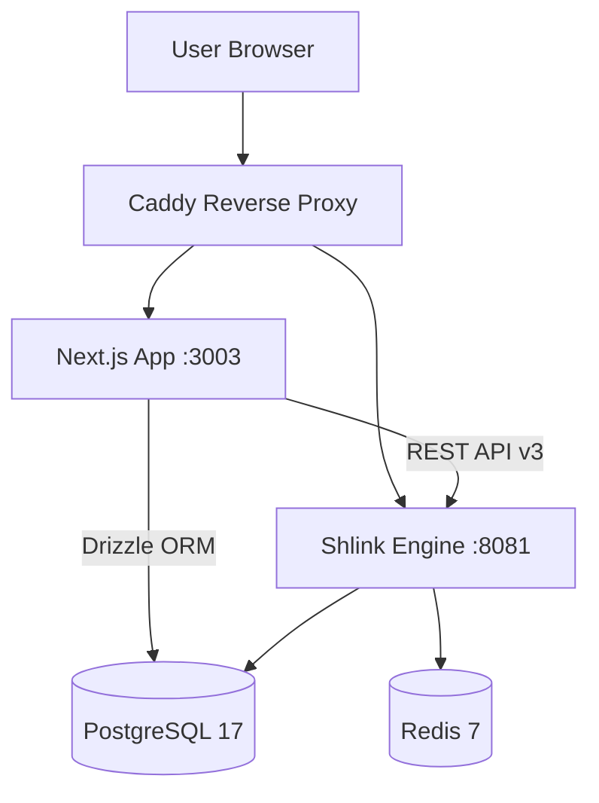

LickityClick is a creator-focused link analytics platform built on top of the **Shlink** open-source engine. It provides UTM building, campaign grouping, and shareable sponsor reports.

## System Diagram

## Tech Stack

| Layer | Choice | Rationale |
| :--- | :--- | :--- |
| **Link Engine** | Shlink v4 | Robust API, multi-domain support, tag scoping. |
| **Framework** | Next.js 16 | App Router for RSC, Server Actions for mutations. |
| **UI** | Tailwind CSS v4 | Rapid development with shadcn/ui components. |
| **Auth** | Better Auth | Self-hosted email/password with Drizzle adapter. |
| **Database** | PostgreSQL 17 | Reliable relational storage for app and engine. |
| **Charts** | Apache ECharts | Rich visualizations for geo and time-series data. |

## Key Subsystems

### Shlink API Client
The `src/lib/shlink.ts` module wraps the Shlink REST API with typed functions for managing links, visits, and redirect rules.

### Analytics Pipeline
Raw visit data is aggregated in `src/lib/analytics.ts` to generate chart-ready payloads for:
- **Clicks Over Time** (Line chart)
- **Geographic Distribution** (World map)
- **Device & Browser Breakdown** (Pie charts)

### Multi-Tenancy
The application is designed for multi-tenancy, where each **Organization** (tenant) owns its own domains, campaigns, and reports. Access is strictly scoped to `org_id` at the database and API levels.
