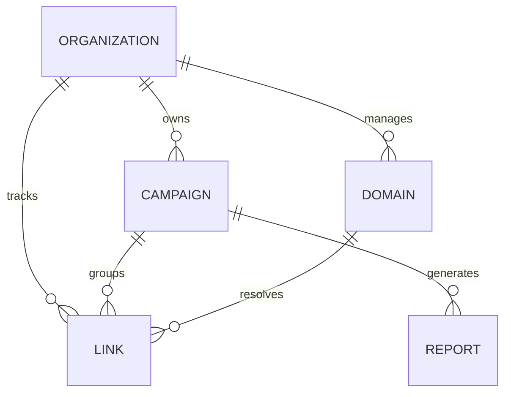

LickityClick uses a PostgreSQL database managed via **Drizzle ORM**. The data is split between application-specific tables and the underlying Shlink engine tables.

## Core Entities

### Organizations (Tenants)
The top-level entity for multi-tenancy.
- **Fields**: \`id\`, \`name\`, \`slug\`, \`plan\` (Free/Paid).
- **Relationships**: Owns Campaigns, Domains, and Reports.

### Campaigns
Logical groupings for marketing initiatives or specific sponsors.
- **Fields**: \`name\`, \`sponsor_name\`, \`status\`, \`shlink_tag\`.
- **Logic**: Every campaign has a unique \`shlink_tag\` used to aggregate analytics from the engine.

### Links
Short URL metadata stored in the app database for UTM management.
- **Fields**: \`short_code\`, \`long_url\`, \`utm_source\`, \`utm_medium\`, \`domain_id\`.
- **Integration**: Maps to a corresponding entry in the Shlink database.

### Reports
Configurations for shareable, public-facing analytics pages.
- **Fields**: \`public_slug\`, \`title\`, \`date_range\`, \`include_geo\`.
- **Access**: Accessible via \`/r/[public_slug]\` without authentication.

## Entity Relationship Diagram

## Authentication Schema
Managed by **Better Auth**, the schema includes standard tables for:
- **Users**: Identity and profile information.
- **Sessions**: Active login sessions.
- **Accounts**: OAuth and credential links.
- **OrgMembers**: Join table connecting Users to Organizations with roles (\`owner\`, \`admin\`, \`member\`).
