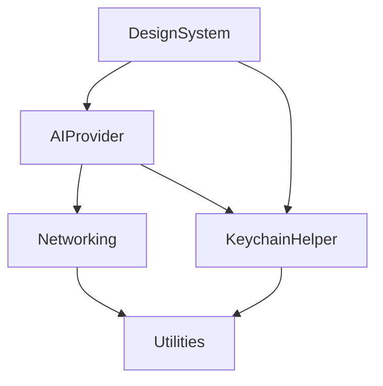

SharedCore is designed as a modular Swift Package, allowing applications to import only the functionality they need while ensuring a clear separation of concerns.

## Dependency Graph

The modules are layered to ensure that low-level primitives (Utilities, Networking) remain independent, while high-level modules (DesignSystem, AIProvider) can leverage shared logic.

## Module Breakdown

### 1. AIProvider
The most complex module, providing a unified interface for multiple Large Language Models.
- **Purpose**: Abstract away the differences between LLM providers.
- **Providers**: Anthropic, OpenAI, Google, xAI, and local Ollama.
- **Key Types**: `AIClient`, `ChatPrompt`, `TokenEstimator`.

### 2. KeychainHelper
A robust wrapper around the macOS Security framework.
- **Purpose**: Secure, type-safe storage for sensitive credentials.
- **Features**: Service-based queries, support for generic passwords, and automated access control.
- **Key Types**: `KeychainManager`, `SecretQuery`.

### 3. DesignSystem
Shared SwiftUI components and design tokens.
- **Purpose**: Ensure visual consistency across the native app fleet.
- **Tokens**: Standardized colors, spacing, and typography scales.
- **Views**: Shared settings views for AI providers and account management.

### 4. Networking
A lightweight, async-first HTTP client.
- **Purpose**: Type-safe networking without external dependencies like Alamofire.
- **Features**: Automatic JSON encoding/decoding, support for streaming responses (for AI), and custom middleware hooks.
- **Key Types**: `HTTPClient`, `Endpoint`.

### 5. Utilities
Essential helpers and extensions.
- **Purpose**: Shared logic for common tasks.
- **Features**: `os.Logger` wrappers, date/time formatting, and string sanitization for shell commands.

## Best Practices

- **Strict Concurrency**: Every module is built for Swift 6. When adding new public types, ensure they conform to `Sendable`.
- **Unit Testing**: Each module includes a comprehensive suite of unit tests. When modifying a module, run `swift test` to ensure no regressions.
- **Documentation**: Use DocC-style comments for all public APIs to ensure they are discoverable within Xcode.
