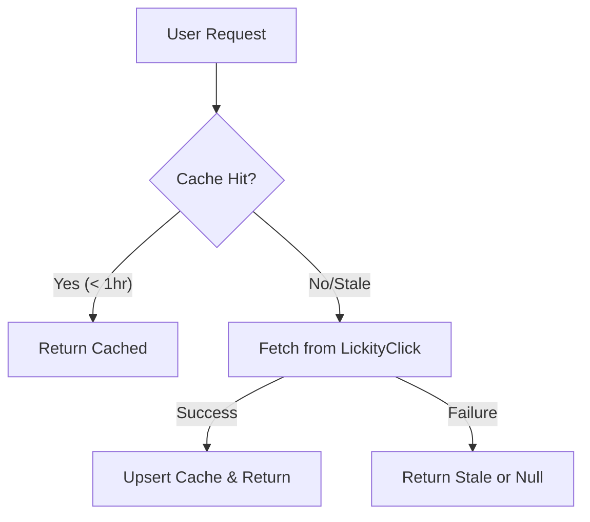

- **Status:** Accepted
- **Date:** 2026-03-16
- **Context:** CLIA-72, builds on CLIA-42/45/49/53

## Context

Sponsor CRM tracks sponsorship deals and generates performance reports. LickityClick is our link management and conversion tracking platform. This ADR defines the actual REST API contract that Sponsor CRM calls on LickityClick to retrieve live metrics.

## Decision

### Authentication

| Mechanism | Details |
|-----------|---------|
| Type | Bearer token |
| Header | `Authorization: Bearer {LICKITYCLICK_API_KEY}` |
| Provisioning | Stored as `LICKITYCLICK_API_KEY` env var |
| Scope | Read-only access to campaigns and metrics |

### Endpoints

#### 1. Get Campaign Metrics
Retrieves aggregate performance metrics for a campaign within a date range.

```http
GET /v1/campaigns/{campaignId}/metrics?startDate={ISO8601}&endDate={ISO8601}
```

**Response Payload:**
```json
{
  "data": {
    "campaignId": "camp_abc123",
    "clicks": 12450,
    "uniqueVisitors": 8320,
    "conversions": 416,
    "revenue": 2496000,
    "conversionRate": 0.05,
    "period": {
      "start": "2026-01-15T00:00:00Z",
      "end": "2026-03-16T23:59:59Z"
    }
  }
}
```

### Caching Strategy

To respect rate limits and ensure UI performance, Sponsor CRM implements a 1-hour TTL cache:



## Consequences

- **Positive**: Clean separation of concerns; graceful degradation via caching.
- **Negative**: Metrics can be up to 1 hour stale.
- **Future**: Webhook support planned to eliminate polling.
